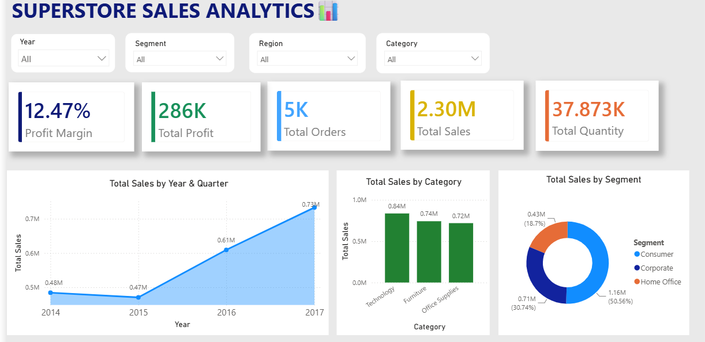
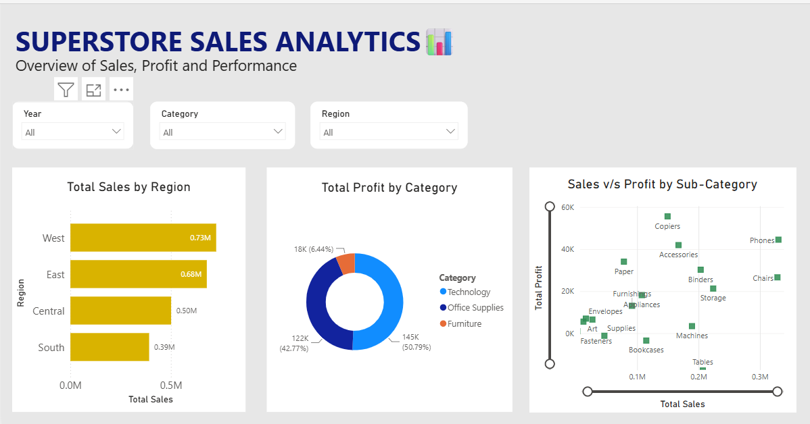
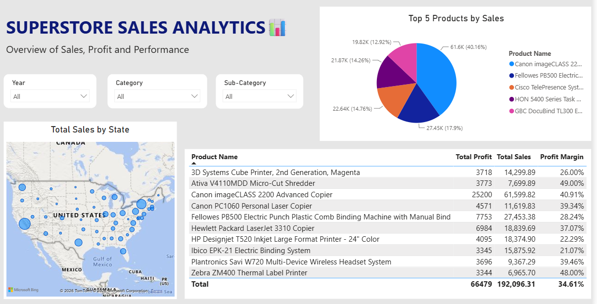

# Superstore Sales Analytics Dashboard

An interactive **Power BI dashboard** built to analyze Superstore sales performance, profitability, orders, quantity, and customer trends.

## Project Overview

This project uses the **Superstore dataset** to build an interactive business intelligence dashboard in **Power BI**. The dashboard allows users to explore sales performance across different years, quarters, regions, customer segments, and product categories.

## Objectives

* Analyze overall sales and profit performance
* Track key business KPIs
* Identify sales and profit trends over time
* Compare performance across product categories
* Analyze regional and customer segment performance
* Build an interactive dashboard for business reporting and analysis

## Tools and Technologies

* **Power BI**
* **DAX**
* **Data Transformation**
* **Data Visualization**
* **Superstore Dataset**

## Dashboard Features

### Overview

The **Overview** page provides a summary of overall business performance through KPI cards and interactive visualizations.

**Key KPIs:**

* Total Sales
* Total Profit
* Total Quantity
* Total Orders
* Profit Margin

**Interactive Slicers:**

* Year
* Segment
* Region
* Category

### Sales Analysis

The **Sales Analysis** page focuses on sales trends over time and provides insights into sales performance across different business dimensions. It helps identify changes in sales, profit, and overall performance across different periods, regions, and customer segments.

### Product Analysis

The **Product Analysis** page provides a deeper view of product- and category-level performance. It helps identify top-performing products, compare product categories, and understand their contribution to overall sales and profitability.

## Dashboard Preview

### Overview — Superstore Sales Overview

### Sales Analysis

### Product Analysis

## Project Files

The project files include the Power BI dashboard, Superstore dataset, and supporting resources used to develop the dashboard.

## Key Skills Demonstrated

* Power BI Dashboard Development
* DAX
* Data Visualization
* KPI Development
* Data Transformation
* Business Analytics
* Interactive Reporting

## Author

**Prerna Thakur**
Computer Science and Data Analytics Student
